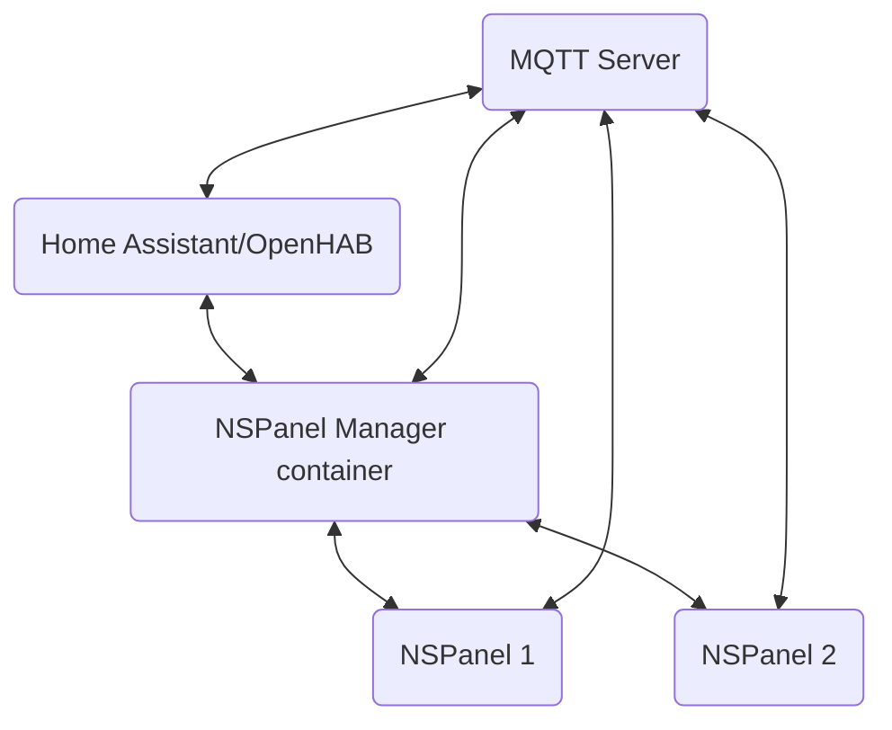

import Centered from '@site/src/components/Centered';

# Architecture

## Software components
There are 3 software components written for the NSPanel Manager project:

* **Web interface**: The web interface that you interact with is built on top of the Django framework. This software gives
  the user an interface to interact and configure the project with. This software also manages the database with settings.
* **MQTT Manager**: There is a second software running in the background on the NSPanel Manager container that
  hosts the web interface. This component is named "MQTTManager". The MQTTManager handles all things with
  MQTT. It loads the config from the web interface via the API and then processes all commands from panels, state
  updates from Home Assistant and OpenHAB and so on. It’s basically the glue that makes the panel’s actions affect
  Home Assistant and OpenHAB. The MQTTManager is also the software that send state updates from Home Assistant
  and OpenHAB to the panels when changes occur.
* **The NSPanel firmware**: The firmware written for the NSPanel has been specifically designed to be as response
  and easy to use as possible. The firmware handles all communication with the TFT (Nextion) display and with
  MQTTManager via MQTT.

## Data flow

<Centered>

</Centered>

The data flow within NSPanel Manager might look intimidating but it’s not that bad. Below is an explanation of all the
arrows above.

### Home Assistant and/or OpenHAB to/from NSPanel Manager container

There is two types of traffic flowing between these nodes:
* **Websocket**: A websocket connection is setup in order for the NSPanel Manager container to receive entity updates
  from Home Assistant and/or OpenHAB but also to sent entity commands (E.. turn light X on to 20%). A websocket
  is used to speed up the communication and also to not have to poll the home automation software for information.
* **HTTP GET API**: The usual HTTP GET API is also used. This is used when adding entities to a room, as an
  example. When pressing the "Add new light" button, the NSPanel Manager container will make an HTTP GET request
  to gather all available entities and then send them back to the client (browser) so that the user may choose what 
  entity to add to the room.

### NSPanel Manager container to/from MQTT

MQTT is used to send updated entity states received from the home automation software out to all NSPanels and also
receive states and commands from NSPanels.

### Home Assistant and/or OpenHAB to/from MQTT

Home Assistant and OpenHAB can leverage the MQTT integration through "Home Assistant MQTT Auto-discovery" (which
OpenHAB can also use) to auto-discover NSPanels and automatically register entities for panel temperature reading, panel
relays, screen state and so on.

### NSPanel Manager container to/from NSPanels

The configuration of lights, scenes and so on does not reside on each panel. The panel only has locally the bare minimum
configuration for setup. When the panel starts and has connected to WiFi it will do a HTTP GET request to the NSPanel
Manager container in order to receive all configuration of entities, screen brightness and really, all settings 
available in the NSPanel Manager web interface.

### MQTT to/from NSPanels

Each NSPanel send states (E.g. temperature) and commands (E.g. turning on a light) over MQTT for the NSPanel Manager
container to pickup. 

The panel also receives commands, E.g. turn on relay 1, turn on screen and so on.

:::info
The complete list of MQTT topics is documented [here](./mqtt-topics).
:::